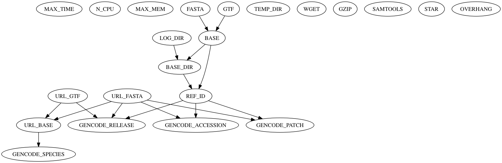

## Overview

The `gencode-ref` example section shows many of the functions of qsubsec. The function of the this section is to identify and download the `.FASTA` and `.GTF` files for a specific [GENCODE](https://www.gencodegenes.org) reference and to use these files to build a [STAR](https://github.com/alexdobin/STAR) reference genome. The steps involved in this process are:

1. Identify and download the `.FASTA` and `.GTF` files for a specific GENCODE release;
2. Decompress the input `.FASTA` and `.GTF` files;
3. Index the decompressed `.FASTA` file; and finally
4. Use STAR to build a reference genome based upon the `.FASTA` and `.GTF` files.

**NB:** This example uses the STAR aligner to build a reference genome index. This task (although common) is both slow and requires a large amount of disk and RAM space. These scripts can therefore hurt your RAM, CPU usage and download bandwidth! Use with care.

## Section Files

The `gencode-ref.qsubsec` section file contains the logic of the analyses we need to run. It is written in [Python 3](https://www.python.org) using the extra builtins as described in the qsubsec [documentation](https://github.com/alastair-droop/qsubsec/blob/master/docs/qsubsec-format.md). Looking at the `gencode-ref.qsubsec` file, we can see that the Python script is incomplete: many parts of the code are replaced with placeholders (enclosed in curly braces), for example:

~~~python
makedirs(expandvars(expanduser('{LOG_DIR}')))
~~~ 

This line of code is valid Python once the placeholder `{LOG_DIR}` has been replaced with a valid string. This is how the qsubsec system works: The `.qsubsec` template file is read in and then has all the placeholders contained within it replaced with their values. The processed file is then executed as a Python3 script to generate the sections to submit.

The values of the tokens are read from the token `.TFF` file (`gencode-ref.tff`). The token definition language is extremely simple but remarkable powerful. Documentation is available [here](https://github.com/alastair-droop/qsubsec/blob/master/docs/TFF-format.md).

We will now go through how to use these two files together to analyse and run the gencode-ref script.

## Preparation

Before we start, we must set the values of several bash environment variables. These are used in the `.TFF` file, and should be set before the scripts will work as intended.

We will use a temporary directory to prevent writing a lot of intermediate files to slow storage. The temporary directory is defined in `$TMPDIR`. We also need to define the output location of our references. This is defined in the variable `$REFDIR`. You should set these to a sensible value before proceeding. For example:

~~~bash
# Set the location of the temporary folder:
export TMPDIR=~/Desktop/temp

# Set the location of the reference folders we'll make:
export REFDIR=~/Desktop/
~~~

Before the script will run, we need to have the executables that the script will call. For this example, you'll need:

* [wget](https://www.gnu.org/software/wget/);
* [samtools](http://www.htslib.org);
* [gzip](http://www.gzip.org); and
* [star](https://github.com/alexdobin/STAR)

Make sure that all of these scripts are installed and executable from the commandline.

**NB:** All of the following commands assume that you've set the directory of your terminal to the gencode-ref folder.

## Section Overview

Once we've set up our bash variables and downloaded all the executables we need, we can begin looking at the script itself. Although it is possible to read the tokenised Python script itself, it is easier to see what would be run when we submit the script. First, we can simply print out the bash script:

~~~bash
# This assumes that you're in the gencode-ref directory.
qsubsec -fbash ./gencode-ref.qsubsec ./gencode-ref.tff
~~~

This command will produce the following output:

~~~bash
if ! test -r $REF_DIR/GRCh38p10_27; then echo "[`date`]: ERROR: file $REF_DIR/GRCh38p10_27 not readable" >> $REF_DIR/GRCh38p10_27/logs/error-GENCODEREF-GRCh38p10_27.log; exit 1; fi
if ! test -w $REF_DIR/GRCh38p10_27; then echo "[`date`]: ERROR: file $REF_DIR/GRCh38p10_27 not writable" >> $REF_DIR/GRCh38p10_27/logs/error-GENCODEREF-GRCh38p10_27.log; exit 1; fi
if ! test -r $REF_DIR/GRCh38p10_27/logs; then echo "[`date`]: ERROR: file $REF_DIR/GRCh38p10_27/logs not readable" >> $REF_DIR/GRCh38p10_27/logs/error-GENCODEREF-GRCh38p10_27.log; exit 1; fi
if ! test -w $REF_DIR/GRCh38p10_27/logs; then echo "[`date`]: ERROR: file $REF_DIR/GRCh38p10_27/logs not writable" >> $REF_DIR/GRCh38p10_27/logs/error-GENCODEREF-GRCh38p10_27.log; exit 1; fi
if ! test -r $TMPDIR; then echo "[`date`]: ERROR: file $TMPDIR not readable" >> $REF_DIR/GRCh38p10_27/logs/error-GENCODEREF-GRCh38p10_27.log; exit 1; fi
if ! test -w $TMPDIR; then echo "[`date`]: ERROR: file $TMPDIR not writable" >> $REF_DIR/GRCh38p10_27/logs/error-GENCODEREF-GRCh38p10_27.log; exit 1; fi
if [ ! -x "$(command -v wget)" ]; then echo "[`date`]: ERROR: file wget not executable" >> $REF_DIR/GRCh38p10_27/logs/error-GENCODEREF-GRCh38p10_27.log; exit 1; fi
if [ ! -x "$(command -v samtools)" ]; then echo "[`date`]: ERROR: file samtools not executable" >> $REF_DIR/GRCh38p10_27/logs/error-GENCODEREF-GRCh38p10_27.log; exit 1; fi
if [ ! -x "$(command -v gzip)" ]; then echo "[`date`]: ERROR: file gzip not executable" >> $REF_DIR/GRCh38p10_27/logs/error-GENCODEREF-GRCh38p10_27.log; exit 1; fi
if [ ! -x "$(command -v STAR)" ]; then echo "[`date`]: ERROR: file STAR not executable" >> $REF_DIR/GRCh38p10_27/logs/error-GENCODEREF-GRCh38p10_27.log; exit 1; fi
echo "[`date`]: section GENCODEREF-GRCh38p10_27 started" >> $REF_DIR/GRCh38p10_27/logs/output-GENCODEREF-GRCh38p10_27.log
echo "[`date`]: reference log directory "$REF_DIR/GRCh38p10_27/logs" already exists" >> $REF_DIR/GRCh38p10_27/logs/output-GENCODEREF-GRCh38p10_27.log
echo "[`date`]: input FASTA file $REF_DIR/GRCh38p10_27/GRCh38p10_27.fasta does not exist; downloading from "ftp://ftp.ebi.ac.uk/pub/databases/gencode/Gencode_human/release_27/GRCh38.p10.genome.fa.gz"" >> $REF_DIR/GRCh38p10_27/logs/output-GENCODEREF-GRCh38p10_27.log
echo "[`date`]: command download_FASTA started" >> $REF_DIR/GRCh38p10_27/logs/output-GENCODEREF-GRCh38p10_27.log
wget -q -O$REF_DIR/GRCh38p10_27/GRCh38p10_27.fasta.gz ftp://ftp.ebi.ac.uk/pub/databases/gencode/Gencode_human/release_27/GRCh38.p10.genome.fa.gz || { echo "[`date`]: command download_FASTA failed" >> $REF_DIR/GRCh38p10_27/logs/error-GENCODEREF-GRCh38p10_27.log; exit 1; }
echo "[`date`]: command download_FASTA completed" >> $REF_DIR/GRCh38p10_27/logs/output-GENCODEREF-GRCh38p10_27.log
echo "[`date`]: command decompress_FASTA started" >> $REF_DIR/GRCh38p10_27/logs/output-GENCODEREF-GRCh38p10_27.log
gzip -d $REF_DIR/GRCh38p10_27/GRCh38p10_27.fasta.gz || { echo "[`date`]: command decompress_FASTA failed" >> $REF_DIR/GRCh38p10_27/logs/error-GENCODEREF-GRCh38p10_27.log; exit 1; }
echo "[`date`]: command decompress_FASTA completed" >> $REF_DIR/GRCh38p10_27/logs/output-GENCODEREF-GRCh38p10_27.log
echo "[`date`]: input GTF file $REF_DIR/GRCh38p10_27/GRCh38p10_27.gtf does not exist; downloading from "ftp://ftp.ebi.ac.uk/pub/databases/gencode/Gencode_human/release_27/gencode.v27.annotation.gtf.gz"" >> $REF_DIR/GRCh38p10_27/logs/output-GENCODEREF-GRCh38p10_27.log
echo "[`date`]: command download_GTF started" >> $REF_DIR/GRCh38p10_27/logs/output-GENCODEREF-GRCh38p10_27.log
wget -q -O$REF_DIR/GRCh38p10_27/GRCh38p10_27.gtf.gz ftp://ftp.ebi.ac.uk/pub/databases/gencode/Gencode_human/release_27/gencode.v27.annotation.gtf.gz || { echo "[`date`]: command download_GTF failed" >> $REF_DIR/GRCh38p10_27/logs/error-GENCODEREF-GRCh38p10_27.log; exit 1; }
echo "[`date`]: command download_GTF completed" >> $REF_DIR/GRCh38p10_27/logs/output-GENCODEREF-GRCh38p10_27.log
echo "[`date`]: command decompress_GTF started" >> $REF_DIR/GRCh38p10_27/logs/output-GENCODEREF-GRCh38p10_27.log
gzip -d $REF_DIR/GRCh38p10_27/GRCh38p10_27.gtf.gz || { echo "[`date`]: command decompress_GTF failed" >> $REF_DIR/GRCh38p10_27/logs/error-GENCODEREF-GRCh38p10_27.log; exit 1; }
echo "[`date`]: command decompress_GTF completed" >> $REF_DIR/GRCh38p10_27/logs/output-GENCODEREF-GRCh38p10_27.log
echo "[`date`]: input FASTA index $REF_DIR/GRCh38p10_27/GRCh38p10_27.fasta.fai does not exist; re-indexing" >> $REF_DIR/GRCh38p10_27/logs/output-GENCODEREF-GRCh38p10_27.log
echo "[`date`]: command index_fasta started" >> $REF_DIR/GRCh38p10_27/logs/output-GENCODEREF-GRCh38p10_27.log
samtools faidx $REF_DIR/GRCh38p10_27/GRCh38p10_27.fasta || { echo "[`date`]: command index_fasta failed" >> $REF_DIR/GRCh38p10_27/logs/error-GENCODEREF-GRCh38p10_27.log; exit 1; }
echo "[`date`]: command index_fasta completed" >> $REF_DIR/GRCh38p10_27/logs/output-GENCODEREF-GRCh38p10_27.log
echo "[`date`]: command star_index started" >> $REF_DIR/GRCh38p10_27/logs/output-GENCODEREF-GRCh38p10_27.log
STAR --runMode genomeGenerate --runThreadN 20 --outTmpDir $TMPDIR/STAR --outFileNamePrefix $REF_DIR/GRCh38p10_27/logs/STAR- --genomeDir $REF_DIR/GRCh38p10_27 --genomeFastaFiles $REF_DIR/GRCh38p10_27/GRCh38p10_27.fasta --sjdbGTFfile $REF_DIR/GRCh38p10_27/GRCh38p10_27.gtf --sjdbOverhang 150 > $REF_DIR/GRCh38p10_27/logs/STAR-index.log || { echo "[`date`]: command star_index failed" >> $REF_DIR/GRCh38p10_27/logs/error-GENCODEREF-GRCh38p10_27.log; exit 1; }
echo "[`date`]: command star_index completed" >> $REF_DIR/GRCh38p10_27/logs/output-GENCODEREF-GRCh38p10_27.log
echo "[`date`]: section GENCODEREF-GRCh38p10_27 completed" >> $REF_DIR/GRCh38p10_27/logs/output-GENCODEREF-GRCh38p10_27.log
~~~

We can see that most of the generated script is testing and logging. We can see only the commands that will be run by using the `-c` flag:

~~~bash
qsubsec -fbash ./gencode-ref.qsubsec ./gencode-ref.tff
~~~

This returns:

~~~
GENCODEREF-GRCh38p10_27 :: download_FASTA:	wget -q -O$REF_DIR/GRCh38p10_27/GRCh38p10_27.fasta.gz ftp://ftp.ebi.ac.uk/pub/databases/gencode/Gencode_human/release_27/GRCh38.p10.genome.fa.gz
GENCODEREF-GRCh38p10_27 :: decompress_FASTA:	gzip -d $REF_DIR/GRCh38p10_27/GRCh38p10_27.fasta.gz
GENCODEREF-GRCh38p10_27 :: download_GTF:	wget -q -O$REF_DIR/GRCh38p10_27/GRCh38p10_27.gtf.gz ftp://ftp.ebi.ac.uk/pub/databases/gencode/Gencode_human/release_27/gencode.v27.annotation.gtf.gz
GENCODEREF-GRCh38p10_27 :: decompress_GTF:	gzip -d $REF_DIR/GRCh38p10_27/GRCh38p10_27.gtf.gz
GENCODEREF-GRCh38p10_27 :: index_fasta:	samtools faidx $REF_DIR/GRCh38p10_27/GRCh38p10_27.fasta
GENCODEREF-GRCh38p10_27 :: star_index:	STAR --runMode genomeGenerate --runThreadN 20 --outTmpDir $TMPDIR/STAR --outFileNamePrefix $REF_DIR/GRCh38p10_27/logs/STAR- --genomeDir $REF_DIR/GRCh38p10_27 --genomeFastaFiles $REF_DIR/GRCh38p10_27/GRCh38p10_27.fasta --sjdbGTFfile $REF_DIR/GRCh38p10_27/GRCh38p10_27.gtf --sjdbOverhang 150 > $REF_DIR/GRCh38p10_27/logs/STAR-index.log
~~~

From this we can easily see the commands that will be run. You could now copy and paste these commands into bash and get exactly the same results as you would by running the script.

If the script writer has bothered to make a sensible description for the script, you can view this using the `-d` flag:

~~~bash
qsubsec -d ./gencode-ref.qsubsec ./gencode-ref.tff
~~~

returns:

~~~
GENCODEREF-GRCh38p10_27	Download and process the GENCODE human release 27 reference GRCh38.p10.
~~~
 
### Specifying Tokens

So far we've used the default tokens specified in the `./gencode-ref.tff` file. We can see which tokens a script needs by using the `-t` flag:

~~~bash
qsubsec -t ./gencode-ref.qsubsec
~~~

returns:

~~~
WGET
GZIP
URL_GTF
LOG_DIR
URL_FASTA
GTF
MAX_MEM
GENCODE_RELEASE
GENCODE_SPECIES
MAX_TIME
SAMTOOLS
TEMP_DIR
STAR
GENCODE_PATCH
GENCODE_ACCESSION
BASE_DIR
FASTA
OVERHANG
REF_ID
N_CPU
~~~

A value must be supplied for each of these tokens before qsubsec can process the script. Although sensible defaults are provided for the tokens, we can override any of these. There is no need to edit the `gencode-ref.tff` file unless you wish to, you can simply re-defined the tokens after they have been read in.

For example, the `gencode-ref.tff` file specified that the script can use 4 CPUs (`{N_CPU} = "4"`). If your machine has more available, we can simply re-define the `N_CPU` token after we've loaded the TFF file:

~~~bash
# Run the script with default tokens, except that we're upping the core count to 8:
qsubsec -fbash ./gencode-ref.qsubsec ./gencode-ref.tff N_CPU=8
~~~

As tokens can depend on other tokens, it is not always obvious what the value of a token is. We can examine how the various tokens interact by using the `parse-tff` script. For example, we can see what the final token values are for our example by running (note that we have to use the `-s` flag to specify that we're adding tokens on the command line as well as from a file file):

~~~
parse-tff ./gencode-ref.tff -s N_CPU=8
~~~

returns:

~~~
"MAX_TIME" = "12:00:00"
"N_CPU" = "8"
"MAX_MEM" = "4G"
"GENCODE_SPECIES" = "human"
"GENCODE_RELEASE" = "27"
"GENCODE_ACCESSION" = "GRCh38"
"GENCODE_PATCH" = "10"
"REF_ID" = "GRCh38p10_27"
"BASE_DIR" = "$REFDIR/GRCh38p10_27"
"LOG_DIR" = "$REFDIR/GRCh38p10_27/logs"
"TEMP_DIR" = "$TMPDIR"
"BASE" = "$REFDIR/GRCh38p10_27/GRCh38p10_27"
"FASTA" = "$REFDIR/GRCh38p10_27/GRCh38p10_27.fasta"
"GTF" = "$REFDIR/GRCh38p10_27/GRCh38p10_27.gtf"
"WGET" = "wget"
"GZIP" = "gzip"
"SAMTOOLS" = "samtools"
"STAR" = "STAR"
"URL_BASE" = "ftp://ftp.ebi.ac.uk/pub/databases/gencode/Gencode_human"
"URL_FASTA" = "ftp://ftp.ebi.ac.uk/pub/databases/gencode/Gencode_human/release_27/GRCh38.p10.genome.fa.gz"
"URL_GTF" = "ftp://ftp.ebi.ac.uk/pub/databases/gencode/Gencode_human/release_27/gencode.v27.annotation.gtf.gz"
"OVERHANG" = "150"
~~~

From this output, we can easily see the tokens we'll use to run the script.

### Visualising the Token Graph

If you have [dot](http://graphviz.org) installed, we can easily generate a dependency graph of the tokens by using the `-g` flag in `parse-tff` to return a dependency graph rather than the values of the tokens:

~~~bash
parse-tff -g ./gencode-ref.tff | dot -Tpng > ./gencode-ref-tokens.png
~~~

returns:

This representation easily shows us how the various tokens depend on each other.

### Running the Section

Once we're happy that the section will do what we want, and that we've specified the tokens correctly, we can execute the script. We can specify the output format using the `-f` flag. If we're running the script locally, we can simply use bash (using `-fbash`). If we're running on a cluster (that uses the [SGE](https://arc.liv.ac.uk/trac/SGE) queue manager), we'll need to use the `qsub` format (`-fqsub`). We can submit the script (rather than view it) using the `-s` flag:

~~~bash
# The following script will submit the entire section (NB: This is a long process!):
# This will only work on a system with qsub installed
qsubsec -fqsub -s ./gencode-ref.qsubsec ./gencode-ref.tff
~~~

If we're running locally, then the qsubsec script will wait for the entire script to complete before returning (this takes a long time). If running through qsub, then the qsubsec script will return as soon as the jobs are submitted.

## Running Multiple Sections

One of the most useful features of qsubsec is that we can simultaneously submit multiple scripts from the same template but using different tokens. For example, we might wish to generate references for GENCODE releases 27 and 21, we can do this by redefining the `GENCODE_RELEASE` token to have two values. We will use the `-d` flag to see what sections will be submitted:

~~~bash
qsubsec -d ./gencode-ref.qsubsec ./gencode-ref.tff GENCODE_RELEASE=21,27
~~~

now returns two sections:

~~~
GENCODEREF-GRCh38p10_21	Download and process the GENCODE human release 21 reference GRCh38.p10.
GENCODEREF-GRCh38p10_27	Download and process the GENCODE human release 27 reference GRCh38.p10.
~~~

We can see the differences in tokens by using parse-tff:

~~~bash
parse-tff ./gencode-ref.tff -sGENCODE_RELEASE=21,27
~~~

Now that we have two different token sets, the output is subtly different:

~~~
[0]: {'MAX_TIME': '12:00:00', 'N_CPU': '4', 'MAX_MEM': '4G', 'GENCODE_SPECIES': 'human', 'GENCODE_RELEASE': '21', 'GENCODE_ACCESSION': 'GRCh38', 'GENCODE_PATCH': '10', 'REF_ID': 'GRCh38p10_21', 'BASE_DIR': '$REFDIR/GRCh38p10_21', 'LOG_DIR': '$REFDIR/GRCh38p10_21/logs', 'TEMP_DIR': '$TMPDIR', 'BASE': '$REFDIR/GRCh38p10_21/GRCh38p10_21', 'FASTA': '$REFDIR/GRCh38p10_21/GRCh38p10_21.fasta', 'GTF': '$REFDIR/GRCh38p10_21/GRCh38p10_21.gtf', 'WGET': 'wget', 'GZIP': 'gzip', 'SAMTOOLS': 'samtools', 'STAR': 'STAR', 'URL_BASE': 'ftp://ftp.ebi.ac.uk/pub/databases/gencode/Gencode_human', 'URL_FASTA': 'ftp://ftp.ebi.ac.uk/pub/databases/gencode/Gencode_human/release_21/GRCh38.p10.genome.fa.gz', 'URL_GTF': 'ftp://ftp.ebi.ac.uk/pub/databases/gencode/Gencode_human/release_21/gencode.v21.annotation.gtf.gz', 'OVERHANG': '150'}
[1]: {'MAX_TIME': '12:00:00', 'N_CPU': '4', 'MAX_MEM': '4G', 'GENCODE_SPECIES': 'human', 'GENCODE_RELEASE': '27', 'GENCODE_ACCESSION': 'GRCh38', 'GENCODE_PATCH': '10', 'REF_ID': 'GRCh38p10_27', 'BASE_DIR': '$REFDIR/GRCh38p10_27', 'LOG_DIR': '$REFDIR/GRCh38p10_27/logs', 'TEMP_DIR': '$TMPDIR', 'BASE': '$REFDIR/GRCh38p10_27/GRCh38p10_27', 'FASTA': '$REFDIR/GRCh38p10_27/GRCh38p10_27.fasta', 'GTF': '$REFDIR/GRCh38p10_27/GRCh38p10_27.gtf', 'WGET': 'wget', 'GZIP': 'gzip', 'SAMTOOLS': 'samtools', 'STAR': 'STAR', 'URL_BASE': 'ftp://ftp.ebi.ac.uk/pub/databases/gencode/Gencode_human', 'URL_FASTA': 'ftp://ftp.ebi.ac.uk/pub/databases/gencode/Gencode_human/release_27/GRCh38.p10.genome.fa.gz', 'URL_GTF': 'ftp://ftp.ebi.ac.uk/pub/databases/gencode/Gencode_human/release_27/gencode.v27.annotation.gtf.gz', 'OVERHANG': '150'}
~~~

By default, we build the reference for a maximum read length of 151 nt by setting the STAR overhang to 150. We can easily generate multiple references with different overhangs by changing this value. However, as the output directory does not include this value, we would end up overriding one reference with the data from another. We can remedy this by simply updating the reference ID to include the overhang. So, we can generate references for GENCODE releases 21 and 27 each with an overhang of 150 and 100 by specifying:

~~~bash
# Show which references we will build when we alter both the RELEASE and the OVERHANG:
qsubsec -d ./gencode-ref.qsubsec ./gencode-ref.tff REF_ID="{GENCODE_ACCESSION}p{GENCODE_PATCH}_{GENCODE_RELEASE}_{OVERHANG}" OVERHANG=100,150 GENCODE_RELEASE=21,27
~~~

returns four sections:

~~~
GENCODEREF-GRCh38p10_21_100	Download and process the GENCODE human release 21 reference GRCh38.p10.
GENCODEREF-GRCh38p10_21_150	Download and process the GENCODE human release 21 reference GRCh38.p10.
GENCODEREF-GRCh38p10_27_100	Download and process the GENCODE human release 27 reference GRCh38.p10.
GENCODEREF-GRCh38p10_27_150	Download and process the GENCODE human release 27 reference GRCh38.p10.
~~~

Note that *all combinations* of multiple tokens are generated. If this is not what you want, you will have to run qsubsec multiple times each with a single set of tokens.

**NB:** This example will re-download the reference FASTA and GTF files for each reference build twice, even though there is no difference in reference when we change the overhang. A more complex script pipeline would split the raw FASTA and GTF data from the reference, but this is outside the scope of this example.

## Filtering Commands

It is sometimes not good desirable to run all of the commands specified in a template. For example, we might not wish to run the STAR indexing script, but simply to download the data for our two reference releases. We can easily do this once we know the command names. These are returned by the `-c` flag:

~~~bash
qsubsec -c ./gencode-ref.qsubsec ./gencode-ref.tff GENCODE_RELEASE=21,27
~~~

returns:

~~~
GENCODEREF-GRCh38p10_21 :: download_FASTA:	wget -q -O$REFDIR/GRCh38p10_21/GRCh38p10_21.fasta.gz ftp://ftp.ebi.ac.uk/pub/databases/gencode/Gencode_human/release_21/GRCh38.p10.genome.fa.gz
GENCODEREF-GRCh38p10_21 :: decompress_FASTA:	gzip -d $REFDIR/GRCh38p10_21/GRCh38p10_21.fasta.gz
GENCODEREF-GRCh38p10_21 :: download_GTF:	wget -q -O$REFDIR/GRCh38p10_21/GRCh38p10_21.gtf.gz ftp://ftp.ebi.ac.uk/pub/databases/gencode/Gencode_human/release_21/gencode.v21.annotation.gtf.gz
GENCODEREF-GRCh38p10_21 :: decompress_GTF:	gzip -d $REFDIR/GRCh38p10_21/GRCh38p10_21.gtf.gz
GENCODEREF-GRCh38p10_21 :: index_fasta:	samtools faidx $REFDIR/GRCh38p10_21/GRCh38p10_21.fasta
GENCODEREF-GRCh38p10_21 :: star_index:	STAR --runMode genomeGenerate --runThreadN 4 --outTmpDir $TMPDIR/STAR --outFileNamePrefix $REFDIR/GRCh38p10_21/logs/STAR- --genomeDir $REFDIR/GRCh38p10_21 --genomeFastaFiles $REFDIR/GRCh38p10_21/GRCh38p10_21.fasta --sjdbGTFfile $REFDIR/GRCh38p10_21/GRCh38p10_21.gtf --sjdbOverhang 150 > $REFDIR/GRCh38p10_21/logs/STAR-index.log
GENCODEREF-GRCh38p10_27 :: download_FASTA:	wget -q -O$REFDIR/GRCh38p10_27/GRCh38p10_27.fasta.gz ftp://ftp.ebi.ac.uk/pub/databases/gencode/Gencode_human/release_27/GRCh38.p10.genome.fa.gz
GENCODEREF-GRCh38p10_27 :: decompress_FASTA:	gzip -d $REFDIR/GRCh38p10_27/GRCh38p10_27.fasta.gz
GENCODEREF-GRCh38p10_27 :: download_GTF:	wget -q -O$REFDIR/GRCh38p10_27/GRCh38p10_27.gtf.gz ftp://ftp.ebi.ac.uk/pub/databases/gencode/Gencode_human/release_27/gencode.v27.annotation.gtf.gz
GENCODEREF-GRCh38p10_27 :: decompress_GTF:	gzip -d $REFDIR/GRCh38p10_27/GRCh38p10_27.gtf.gz
GENCODEREF-GRCh38p10_27 :: index_fasta:	samtools faidx $REFDIR/GRCh38p10_27/GRCh38p10_27.fasta
GENCODEREF-GRCh38p10_27 :: star_index:	STAR --runMode genomeGenerate --runThreadN 4 --outTmpDir $TMPDIR/STAR --outFileNamePrefix $REFDIR/GRCh38p10_27/logs/STAR- --genomeDir $REFDIR/GRCh38p10_27 --genomeFastaFiles $REFDIR/GRCh38p10_27/GRCh38p10_27.fasta --sjdbGTFfile $REFDIR/GRCh38p10_27/GRCh38p10_27.gtf --sjdbOverhang 150 > $REFDIR/GRCh38p10_27/logs/STAR-index.log
~~~

From the above output, we can see that in both sections, we wish to remove the command with the name `star_index`. We can do this by using the `-l` flag with a [regular expression](https://en.wikipedia.org/wiki/Regular_expression#POSIX_basic_and_extended) that identifies which command names we mean. This has two modes: either include only matching commands, or exclude matching commands. If we prefix our regular expression with an exclamation mark, it will exclude matching commands.

So, we can exclude the two `star_index` commands by using:

~~~bash
qsubsec -c -l'!star_index' ./gencode-ref.qsubsec ./gencode-ref.tff GENCODE_RELEASE=21,27
~~~

returns:

~~~
GENCODEREF-GRCh38p10_21 :: download_FASTA:	wget -q -O$REFDIR/GRCh38p10_21/GRCh38p10_21.fasta.gz ftp://ftp.ebi.ac.uk/pub/databases/gencode/Gencode_human/release_21/GRCh38.p10.genome.fa.gz
GENCODEREF-GRCh38p10_21 :: decompress_FASTA:	gzip -d $REFDIR/GRCh38p10_21/GRCh38p10_21.fasta.gz
GENCODEREF-GRCh38p10_21 :: download_GTF:	wget -q -O$REFDIR/GRCh38p10_21/GRCh38p10_21.gtf.gz ftp://ftp.ebi.ac.uk/pub/databases/gencode/Gencode_human/release_21/gencode.v21.annotation.gtf.gz
GENCODEREF-GRCh38p10_21 :: decompress_GTF:	gzip -d $REFDIR/GRCh38p10_21/GRCh38p10_21.gtf.gz
GENCODEREF-GRCh38p10_21 :: index_fasta:	samtools faidx $REFDIR/GRCh38p10_21/GRCh38p10_21.fasta
GENCODEREF-GRCh38p10_27 :: download_FASTA:	wget -q -O$REFDIR/GRCh38p10_27/GRCh38p10_27.fasta.gz ftp://ftp.ebi.ac.uk/pub/databases/gencode/Gencode_human/release_27/GRCh38.p10.genome.fa.gz
GENCODEREF-GRCh38p10_27 :: decompress_FASTA:	gzip -d $REFDIR/GRCh38p10_27/GRCh38p10_27.fasta.gz
GENCODEREF-GRCh38p10_27 :: download_GTF:	wget -q -O$REFDIR/GRCh38p10_27/GRCh38p10_27.gtf.gz ftp://ftp.ebi.ac.uk/pub/databases/gencode/Gencode_human/release_27/gencode.v27.annotation.gtf.gz
GENCODEREF-GRCh38p10_27 :: decompress_GTF:	gzip -d $REFDIR/GRCh38p10_27/GRCh38p10_27.gtf.gz
GENCODEREF-GRCh38p10_27 :: index_fasta:	samtools faidx $REFDIR/GRCh38p10_27/GRCh38p10_27.fasta
~~~

**NB:** We need to use single quotes around the regular expression otherwise the exclamation mark confuses bash.

Later on, we can re-run the indexing commands using the opposite regular expression:

~~~bash
qsubsec -c -l'star_index' ./gencode-ref.qsubsec ./gencode-ref.tff GENCODE_RELEASE=21,27
~~~

returns only the two STAR indexing commands:

~~~
GENCODEREF-GRCh38p10_21 :: star_index:	STAR --runMode genomeGenerate --runThreadN 4 --outTmpDir $TMPDIR/STAR --outFileNamePrefix $REFDIR/GRCh38p10_21/logs/STAR- --genomeDir $REFDIR/GRCh38p10_21 --genomeFastaFiles $REFDIR/GRCh38p10_21/GRCh38p10_21.fasta --sjdbGTFfile $REFDIR/GRCh38p10_21/GRCh38p10_21.gtf --sjdbOverhang 150 > $REFDIR/GRCh38p10_21/logs/STAR-index.log
GENCODEREF-GRCh38p10_27 :: star_index:	STAR --runMode genomeGenerate --runThreadN 4 --outTmpDir $TMPDIR/STAR --outFileNamePrefix $REFDIR/GRCh38p10_27/logs/STAR- --genomeDir $REFDIR/GRCh38p10_27 --genomeFastaFiles $REFDIR/GRCh38p10_27/GRCh38p10_27.fasta --sjdbGTFfile $REFDIR/GRCh38p10_27/GRCh38p10_27.gtf --sjdbOverhang 150 > $REFDIR/GRCh38p10_27/logs/STAR-index.log
~~~

## Summary

Hopefully by now you can see how the qsubsec template system could simplify your pipeline definitions.
